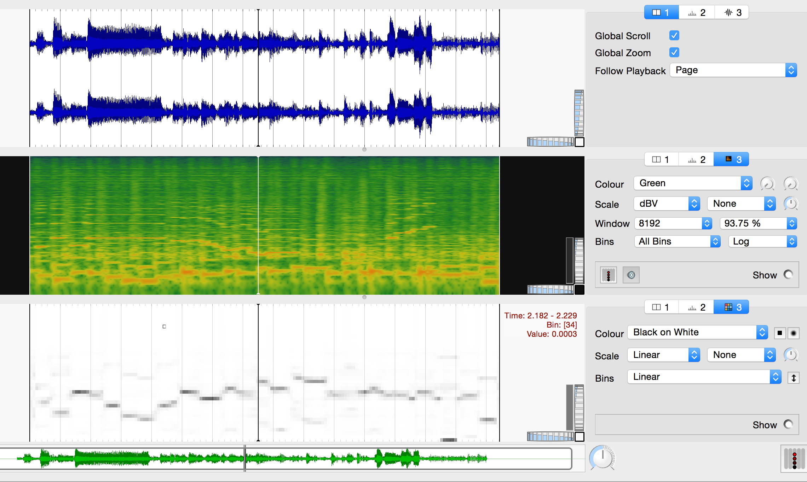

# Walking Bass Transcription

Algorithm for walking bass transcription in jazz ensemble recordings using Deep Neural Networks (DNN)
  - J. Abeßer, S. Balke, K. Frieler, M. Pfleiderer, M. Müller: Deep Learning for Jazz Walking Bass Transcription, AES conference on Semantic Audio, Erlangen, Germany, 2017

Audio examples can be found here:
  - http://www.audiolabs-erlangen.de/resources/MIR/2017-AES-WalkingBassTranscription/

This algorithm was used to create the beat-wise bass pitch values included in the Weimar Jazz Database
  - http://jazzomat.hfm-weimar.de/dbformat/dboverview.html

The script requires the Python packages
  - python 3.X
  - numpy
  - scipy
  - keras
  - librosa
  - pysoundfile
  - h5py

We recommend you to install *miniconda* (https://conda.io/miniconda.html).
You can create a suitable environment using
```
conda env create -f conda_environment.yml
```
and activated it via
```
source activate walking_bass_transcription
```

## Run a test file

Now you can run the transcription algorithm on a test file by calling
```
python transcriber.py
```
Please see the docstrings for further documentation.

## Results

After running the transcriber on the test file ```ArtPepper_Anthropology_Excerpt.wav```, the bass saliency spectrogram is exported as CSV file ```ArtPepper_Anthropology_Excerpt_bass_pitch_saliency.csv```,
which can be imported into an empty pane in SonicVisualizer using the parameters
 - Timing is specified: Implicitly: rows are equally spaced in time
 - Audio sample rate (Hz): 22050
 - Frame increment between rows: 1024
 
Here's an example of the output:
 - WAV form
 - Spectrogram (colour: green, scale: dBV, window: 8192, overlap 93.75%, Bins: all bins, log)
 - bass saliency (colour: black on white, scale: linear, bins: linear)



Enjoy.
